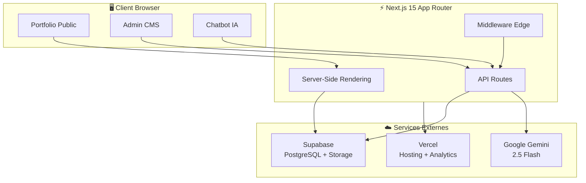
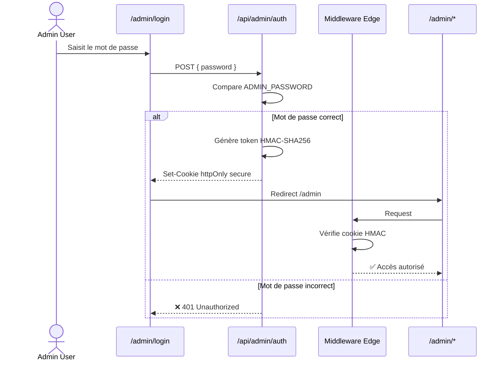
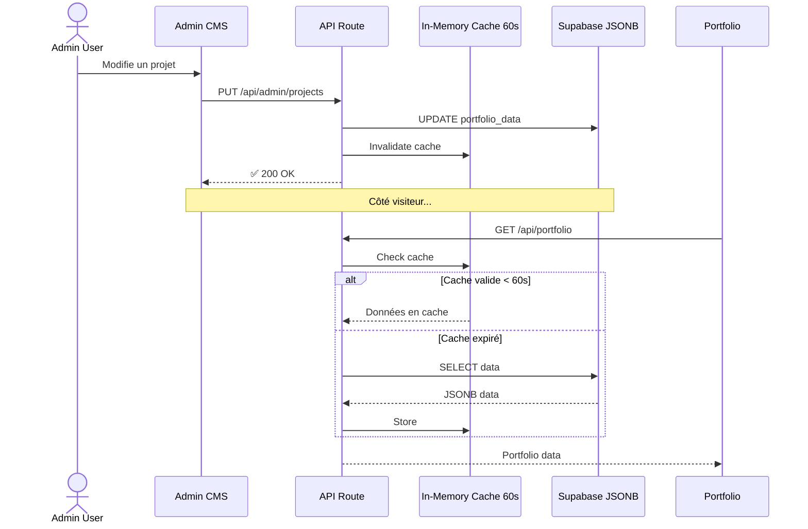
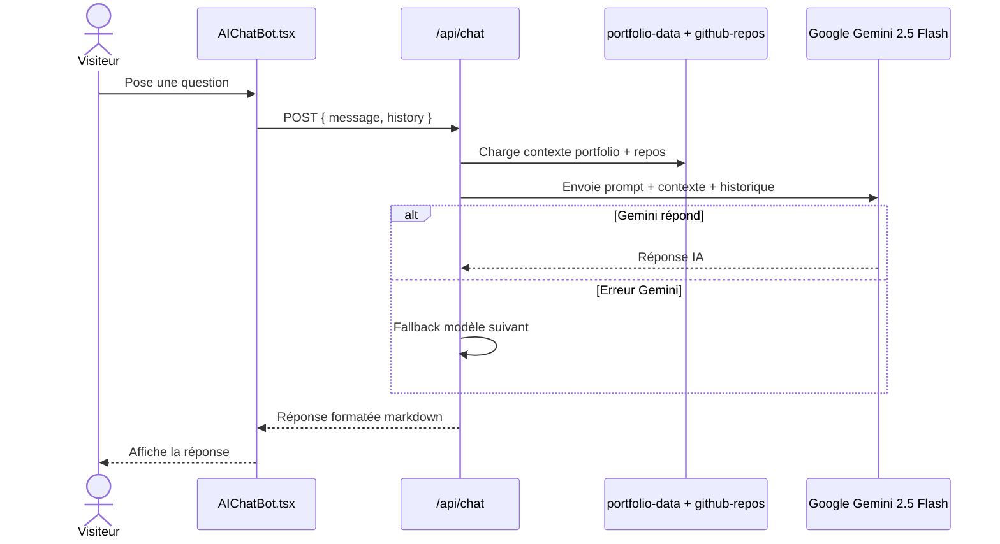
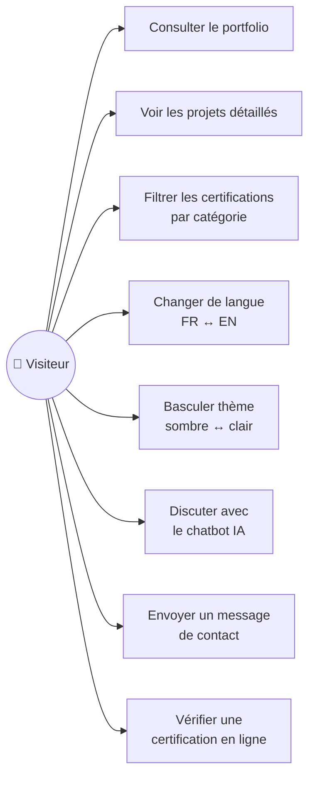
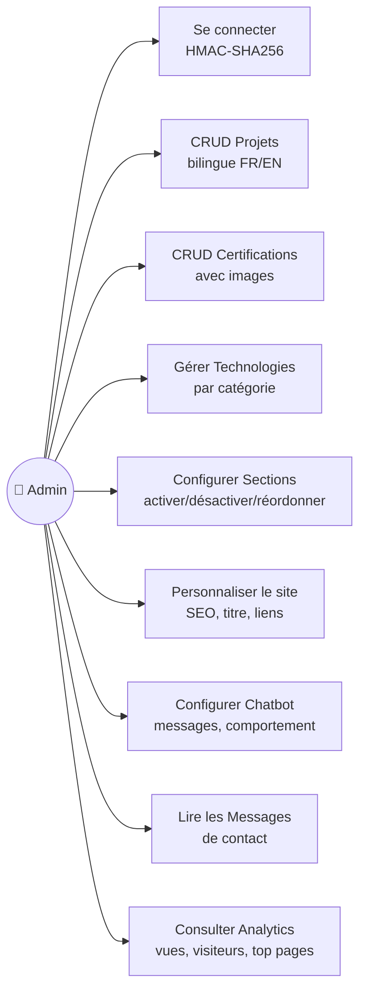
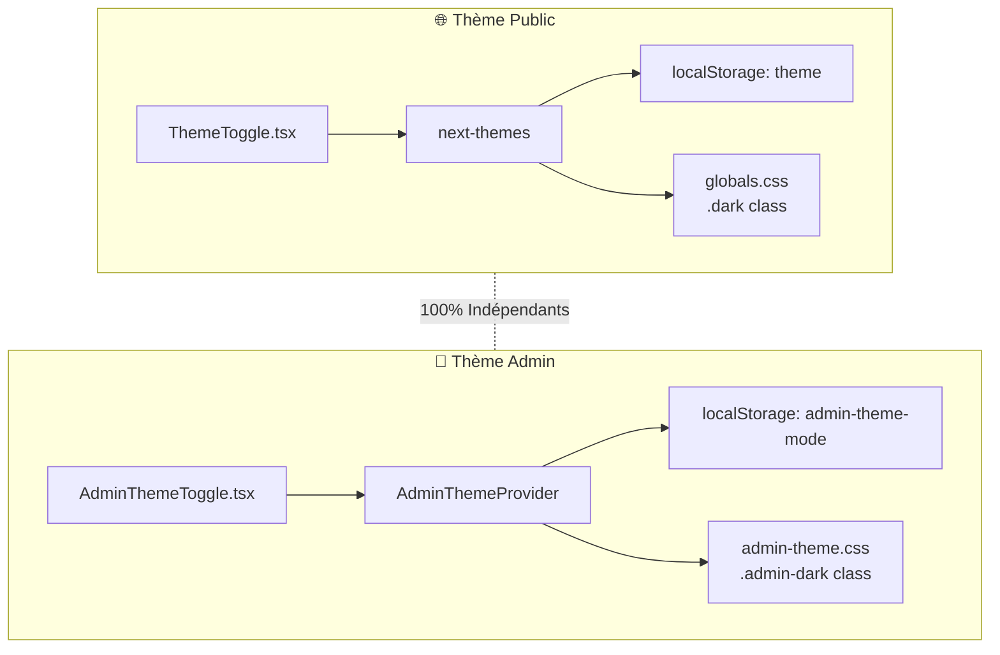
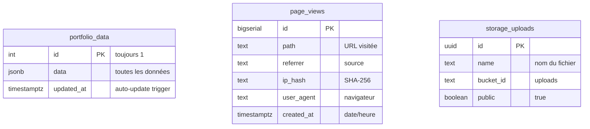

# 🚀 Portfolio CMS Template

> Portfolio professionnel full-stack avec admin CMS, chatbot IA et thèmes indépendants — prêt à personnaliser.

[](https://nextjs.org/)
[](https://typescriptlang.org/)
[](https://tailwindcss.com/)
[](https://supabase.com/)
[](https://ai.google.dev/)
[](https://vercel.com/)

Portfolio professionnel avec un dashboard admin CMS intégré, un chatbot IA alimenté par Gemini et un stockage cloud via Supabase. Conçu pour être entièrement administrable sans toucher au code.

🔗 **Demo** : [sineng-juvenal.me](https://sineng-juvenal.me)

---

## 📸 Aperçu

| Portfolio (Dark Mode) | Admin Dashboard |
|:---:|:---:|
| Hero animé avec terminal interactif | CMS complet avec gestion de contenu |

---

## ✨ Fonctionnalités

### 🌐 Portfolio Public
- **Hero animé** avec terminal interactif simulant des commandes shell
- **6 sections dynamiques** : Sécurité, Projets, Certifications, Compétences, Profil, Vision
- **Cartes projets** avec images `next/image`, stack, badges, liens GitHub/démo
- **Certifications** avec pagination (6/page), filtres par catégorie, images
- **Chatbot IA** (Google Gemini 2.5 Flash) avec contexte enrichi + fallback multi-modèles
- **Formulaire de contact** avec stockage des messages + rate limiting
- **Thème sombre/clair** indépendant (next-themes)
- **i18n FR/EN** complet (~130+ clés) avec toggle dans la navbar
- **SEO** : JSON-LD (Person, WebSite, Course), meta dynamiques, sitemap, robots.txt
- **Accessibilité** : aria-live, aria-current, role=tablist/tab
- **Animations** : fade-up, scroll-reveal, stagger-children, glassmorphism
- **Performance** : cache mémoire 60s, loading skeleton, `next/image` lazy loading
- **Analytics** : Vercel Analytics + Speed Insights + tracking custom (page_views)
- **100% responsive** (mobile, tablette, desktop)

### 🔐 Admin CMS (Dashboard)
- **9 pages d'administration** :
  - 📊 **Dashboard** — Vue d'ensemble
  - 📈 **Analytics** — Graphe SVG (vues/visiteurs), sélecteur de période, top pages
  - 📑 **Sections** — Activer/désactiver, réordonner les sections
  - 💼 **Projets** — CRUD complet avec champs bilingues (FR + EN)
  - ⚙️ **Technologies** — Gérer la stack par catégorie
  - 🏅 **Certifications** — CRUD avec images, catégorie, URL de vérification
  - 🤖 **Chatbot** — Configurer le comportement de l'IA
  - 💬 **Messages** — Lire les messages du formulaire de contact
  - ⚡ **Personnalisation** — Titre, description, hero, footer, liens sociaux
- **Thème admin isolé** : palette bleue indépendante du portfolio (vert)
- **Auth HMAC-SHA256** avec cookies httpOnly + secure + sameSite
- **Responsive** : sidebar mobile avec overlay

### ☁️ Infrastructure
- **Dual-mode storage** : Supabase en production, JSON local en développement
- **Rate limiting** : in-memory per-IP (chat 15/min, contact 3/10min)
- **Security headers** : X-Content-Type-Options, X-Frame-Options, X-XSS-Protection, Referrer-Policy, Permissions-Policy
- **Error boundaries** : error.tsx + global-error.tsx avec retry
- **CI/CD** : GitHub Actions (tsc + build) sur push/PR
- **Auto-seed** : données initiales auto-importées depuis JSON local

---

## 🏗️ Architecture

```
src/
├── app/
│   ├── page.tsx                  # Page principale du portfolio
│   ├── layout.tsx                # Layout racine + metadata SEO + JSON-LD
│   ├── globals.css               # Thème public + animations
│   ├── loading.tsx               # Loading skeleton shimmer
│   ├── error.tsx                 # Error boundary
│   ├── global-error.tsx          # Global error boundary
│   ├── admin/
│   │   ├── layout.tsx            # Layout admin (sidebar + AdminThemeProvider)
│   │   ├── admin-theme.css       # Thème admin indépendant
│   │   ├── page.tsx              # Dashboard
│   │   ├── analytics/            # Graphe analytics SVG
│   │   ├── certifications/       # CRUD certifications
│   │   ├── chatbot/              # Configuration chatbot IA
│   │   ├── login/                # Page de connexion
│   │   ├── messages/             # Messages reçus
│   │   ├── projects/             # CRUD projets
│   │   ├── sections/             # Ordre & activation sections
│   │   ├── settings/             # Paramètres globaux
│   │   └── stacks/               # Technologies
│   └── api/
│       ├── admin/                # Routes protégées (auth, CRUD, upload, analytics)
│       ├── analytics/track/      # Tracking page views
│       ├── chat/                 # Chatbot Gemini AI
│       ├── contact/              # Formulaire de contact
│       └── portfolio/            # API publique avec cache
├── components/
│   ├── AIChatBot.tsx             # Chatbot flottant + rendu markdown
│   ├── AdminThemeToggle.tsx      # Toggle thème admin (indépendant)
│   ├── AnalyticsChart.tsx        # Graphe SVG analytics admin
│   ├── Hero.tsx                  # Hero avec terminal animé
│   ├── Navbar.tsx                # Navigation dynamique
│   ├── PageViewTracker.tsx       # Tracking non-bloquant (sendBeacon)
│   ├── ProjectCard.tsx           # Carte projet avec next/image
│   ├── ThemeToggle.tsx           # Toggle thème public
│   ├── Footer.tsx                # Pied de page
│   └── ...                       # Autres composants de section
├── data/
│   ├── portfolio-data.json       # ← VOS DONNÉES (à remplacer)
│   ├── portfolio-data.template.json  # Données d'exemple
│   └── github-repos.json         # Repos GitHub enrichis (contexte chatbot)
├── lib/
│   ├── types.ts                  # Types TypeScript partagés
│   ├── data-manager.ts           # Cache 60s + dual storage Supabase/JSON
│   ├── rate-limit.ts             # Rate limiter in-memory
│   ├── auth.ts                   # Auth HMAC-SHA256
│   └── supabase.ts               # Client Supabase admin
├── providers/
│   ├── ThemeProvider.tsx          # Thème public (next-themes)
│   ├── AdminThemeProvider.tsx     # Thème admin (indépendant)
│   └── LanguageProvider.tsx       # i18n FR/EN
└── middleware.ts                  # Protection admin + security headers
```

---

## 📊 Schémas d'architecture

### Architecture globale



### Flux d'authentification admin



### Flux de données — CRUD Admin



### Flux du chatbot IA



### Cas d'utilisation — Visiteur



### Cas d'utilisation — Administrateur



### Système de thèmes indépendants



### Base de données Supabase



---

## 🚀 Guide d'installation rapide

> **Temps estimé** : 15-20 minutes

### Prérequis

| Outil | Version | Lien |
|---|---|---|
| Node.js | ≥ 18 | [nodejs.org](https://nodejs.org/) |
| npm ou yarn | dernière | inclus avec Node.js |
| Compte Supabase | gratuit | [supabase.com](https://supabase.com/) |
| Compte Google AI | gratuit | [aistudio.google.com](https://aistudio.google.com/) |
| Compte Vercel | gratuit | [vercel.com](https://vercel.com/) |

### Étape 1 — Cloner et installer

```bash
git clone https://github.com/SKJUV/portfolio.git my-portfolio
cd my-portfolio
npm install
```

### Étape 2 — Variables d'environnement

```bash
cp .env.example .env.local
```

Remplir `.env.local` :

```env
# Obligatoire
ADMIN_PASSWORD=votre_mot_de_passe        # Accès admin
ADMIN_SECRET=                             # openssl rand -hex 32

# Supabase (requis en production)
NEXT_PUBLIC_SUPABASE_URL=https://xxx.supabase.co
SUPABASE_SERVICE_ROLE_KEY=eyJhbGci...

# Gemini AI (optionnel)
GEMINI_API_KEY=AIzaSy...
```

### Étape 3 — Configurer Supabase

1. Créer un projet sur [supabase.com](https://supabase.com/dashboard)
2. **SQL Editor** → **New query** → Copier/coller `supabase-schema.sql` → **Run**
3. Récupérer les clés dans **Settings > API** :
   - `Project URL` → `NEXT_PUBLIC_SUPABASE_URL`
   - `service_role key` → `SUPABASE_SERVICE_ROLE_KEY`

> ⚠️ Utiliser la clé **service_role** (pas anon !).

### Étape 4 — Personnaliser les données

```bash
# Copier le template
cp src/data/portfolio-data.template.json src/data/portfolio-data.json

# Éditer avec vos informations
nano src/data/portfolio-data.json
```

Ou tout configurer via l'admin CMS après le premier lancement.

### Étape 5 — Lancer

```bash
npm run dev
```

| URL | Description |
|---|---|
| [localhost:3000](http://localhost:3000) | Portfolio |
| [localhost:3000/admin/login](http://localhost:3000/admin/login) | Admin |

---

## 🌍 Déploiement Vercel

1. Importer le repo sur [vercel.com/new](https://vercel.com/new)
2. Ajouter les variables d'environnement :

| Variable | Requis | Description |
|---|---|---|
| `ADMIN_PASSWORD` | ✅ | Mot de passe admin |
| `ADMIN_SECRET` | ✅ | `openssl rand -hex 32` |
| `NEXT_PUBLIC_SUPABASE_URL` | ✅ | URL Supabase |
| `SUPABASE_SERVICE_ROLE_KEY` | ✅ | Clé service_role |
| `GEMINI_API_KEY` | ❌ | Active le chatbot IA |

3. **Domaine custom** (optionnel) : Settings > Domains, puis chez le registrar :
   - A : `76.76.21.21`
   - CNAME : `cname.vercel-dns.com`

Chaque push sur `main` → déploiement automatique.

---

## 📋 Structure des données

Voir le fichier `src/data/portfolio-data.template.json` pour un exemple complet.

### Résumé des clés principales

| Clé | Description | Bilingue |
|---|---|---|
| `settings` | Titre, description SEO, hero, footer, liens | ✅ |
| `sections[]` | 6 sections (id, title, icon, enabled, order, component) | ✅ |
| `projects[]` | Projets avec stack, badges, liens, images | ✅ |
| `certifications[]` | Certifications avec plateforme, date, URL, image | ✅ |
| `securitySkills[]` | Compétences sécurité (icon, title, tags) | ✅ |
| `skillCategories[]` | Catégories de compétences (icon, items[]) | ✅ |
| `profileCategories[]` | Profil : formation, expérience, outils | ✅ |
| `technologies[]` | Stack technique (id, name, category) | ❌ |
| `terminalLines[]` | Commandes du terminal hero (command, output) | ❌ |
| `chatBotSettings` | Configuration du chatbot IA | ❌ |
| `messages[]` | Messages reçus (géré automatiquement) | ❌ |

> **Bilingue** = les champs ont une version `_en` (ex: `title` + `title_en`).

---

## 🛠️ Personnalisation avancée

### Modifier les couleurs du thème public

Éditer `src/app/globals.css` :

```css
:root {
  --primary: 152 70% 35%;    /* Vert → changer la teinte HSL */
  --accent: 200 80% 45%;     /* Bleu accent */
}
.dark {
  --primary: 152 100% 50%;   /* Vert néon en dark mode */
}
```

### Modifier les couleurs du thème admin

Éditer `src/app/admin/admin-theme.css` :

```css
.admin-theme {
  --primary: 220 90% 56%;    /* Bleu → changer */
}
.admin-theme.admin-dark {
  --primary: 220 90% 62%;
}
```

### Ajouter une nouvelle section

1. Créer `src/components/MaSection.tsx`
2. Ajouter le mapping dans `src/app/page.tsx`
3. Ajouter dans `portfolio-data.json` → `sections[]` :
   ```json
   { "id": "ma-section", "title": "Ma Section", "icon": "🎯", "enabled": true, "order": 6, "component": "MaSection" }
   ```

### Modifier les commandes du terminal

Éditer `terminalLines` dans `portfolio-data.json` :

```json
{ "command": "$ whoami", "output": "votre_nom — votre_titre" }
```

---

## 🔒 Sécurité

| Mesure | Détail |
|---|---|
| Auth HMAC-SHA256 | Cookies `httpOnly`, `secure`, `sameSite=strict` |
| Middleware Edge | Protection `/admin/*` et `/api/admin/*` |
| Security Headers | 6 headers (X-Content-Type-Options, X-Frame-Options, etc.) |
| Rate Limiting | Chat 15/min, Contact 3/10min, per-IP |
| RLS Supabase | Lecture publique, écriture service_role uniquement |
| Validation fichiers | MIME whitelist + taille max |

---

## 📝 Scripts

```bash
npm run dev       # Développement (localhost:3000)
npm run build     # Build production
npm run start     # Serveur production
npm run lint      # ESLint
```

---

## ❓ FAQ

| Question | Réponse |
|---|---|
| Le chatbot ne répond pas intelligemment ? | Ajoutez `GEMINI_API_KEY` dans `.env.local` |
| Données pas à jour sur Vercel ? | Vérifiez `SUPABASE_SERVICE_ROLE_KEY` (pas anon) |
| Peut-on l'utiliser sans Supabase ? | Oui, en dev le JSON local est utilisé |
| Thème admin lié au site ? | Non, 100% indépendants |
| Comment ajouter une section ? | Composant React + mapping dans page.tsx + entrée JSON |

---

## 🛣️ Roadmap

- [ ] Export PDF du CV
- [ ] Intégration GitHub API auto pour les repos
- [ ] Blog intégré avec MDX
- [ ] Tests E2E avec Playwright
- [ ] PWA (Progressive Web App)
- [ ] Mode multi-langue (3+ langues)

---

## 📄 Licence

MIT — libre d'utilisation, modification et distribution.

---

<div align="center">

**Template créé par [SINENG KENGNI Juvenal](https://sineng-juvenal.me)**

*🚀 Next.js 15 • Supabase • Google Gemini • Vercel*

</div>
